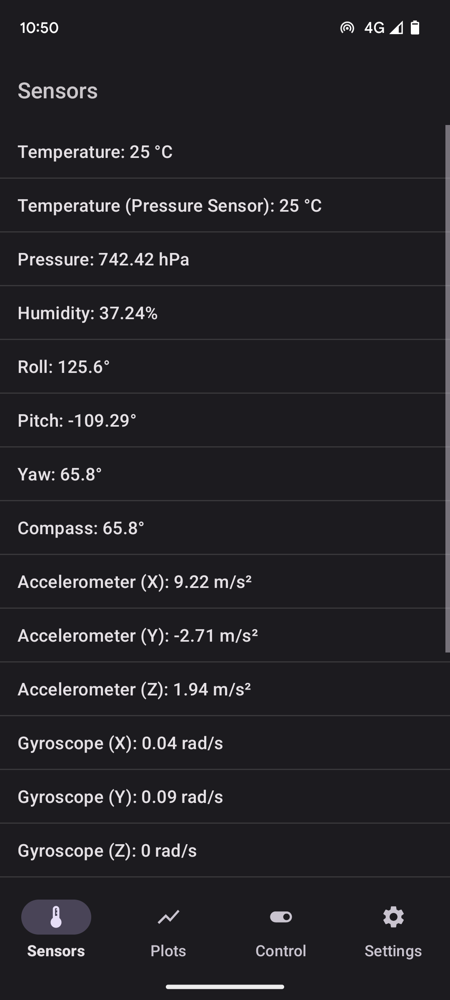
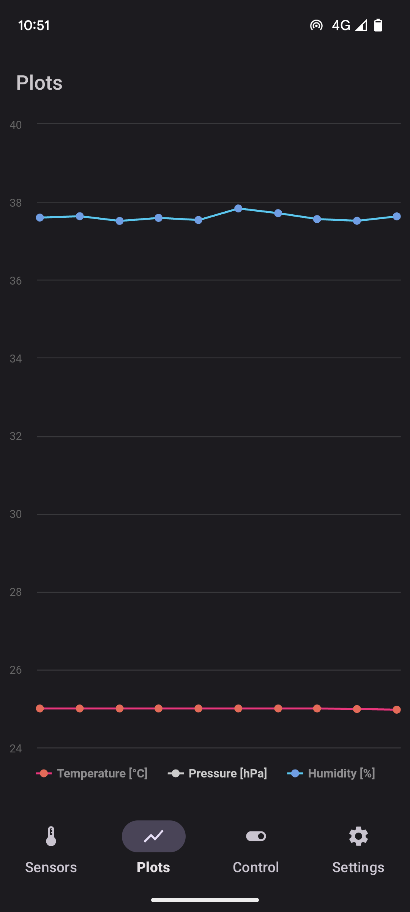
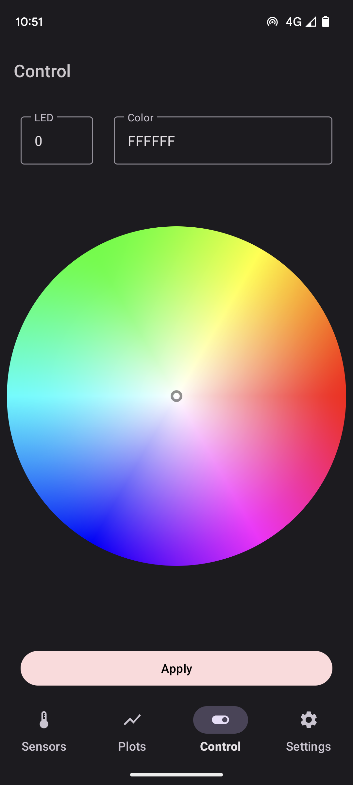
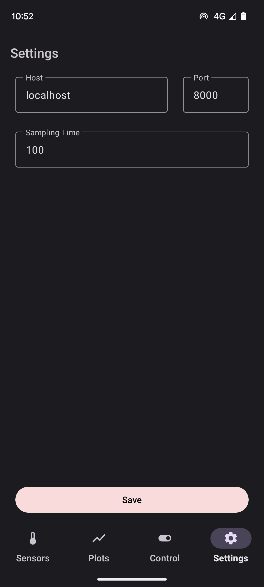

<h1 align="center">
  
   SixthSense  
</h1>

  <a href="https://github.com/ikajdan/sixthsense_server">Web Client</a> •
  <a href="https://github.com/ikajdan/sixthsense_mobile">Mobile Client</a> •
  <a href="https://github.com/ikajdan/sixthsense_desktop">Desktop Client</a>

The aim of this project was to create an IoT (Internet of Things) system composed of a SBC (Single Board Computer) with a Sense HAT attached. The server should host a REST (Representational State Transfer) API (Application Programming Interface) that enables clients to read and control peripherals of the hat.

Data from various sensors on the Sense HAT should be collected and exposed through the REST API. Real-time plots of the sensor data should be displayed on each client. The user should be able to control the LED matrix on the Sense HAT.

All the clients should expose a GUI (Graphical User Interface) to the user allowing for interaction with the embedded system. Three REST clients were developed:
- [web-based client](https://github.com/ikajdan/sixthsense_server),
- Android mobile client (this repository),
- [Linux desktop client](https://github.com/ikajdan/sixthsense_desktop).

## Mobile Client

The mobile client is written in Kotlin. It uses the Volley library to make request to the server. The charts are plotted using the AAChart library.
For each view there is a model assigned, to store the data, separately. The list containing sensors is generated dynamically, based on the response from the server.

 

  
&nbsp; &nbsp; &nbsp; &nbsp;
  
&nbsp; &nbsp; &nbsp; &nbsp;
  
&nbsp; &nbsp; &nbsp; &nbsp;
  
    
  <em>Application views.</em>

 

## License

This project is licensed under the MIT License. See the [LICENSE](LICENSE.md) file for details.
